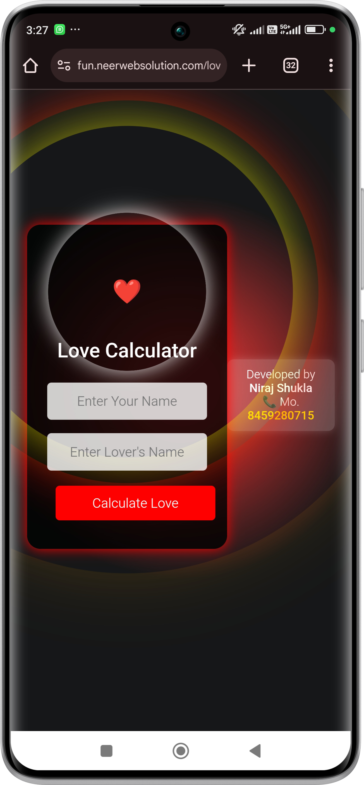

# Love-Calculator

Buy this Script whatsapp on 8459280715 with script name

Here is a well-structured `README.md` file for your **Love Calculator** project:  

---

# 💖 Love Calculator 💖  

Welcome to the **Love Percentage Calculator**, a fun and interactive tool to calculate love compatibility between two individuals. Enter your names and see how much love exists between you and your partner!  

Love Calc, Love Calculator,  Viral Script,  Love Match using php myself database.
---

## 🚀 Features  

✅ Beautiful & Responsive UI  
✅ Fun Love Percentage Calculation  
✅ Share Your Love with Others  
✅ Smooth Animations & Icons  
✅ Easy to Customize  

---

## 📸 Screenshot  

Screenshot_2025-02-12-15-23-54-734_com.android.chrome-edit.png
  


*( Buy this Script whatsapp on 8459280715 with script name .)*  

---

## 🛠️ Installation  

1. **Clone the repository**  
   ```bash
   git clone https://github.com/love-calc_neerweb/love-calculator.git
   ```
2. **Open `index.php` in your browser.**  
3. **Enjoy & Share the Love!**  

---

## 🔧 Usage  

1. Enter your **name** and **partner’s name**.  
2. Click on **"Calculate"**.  
3. View your **Love Percentage**!  
4. Click **"Share Your Love"** to spread happiness.  

---

## 📞 Contact for Development  

👨‍💻 **Developer:** Niraj Shukla  
📞 **Mobile:** 8459280715  
📧 **Email:** [neeraj000369@gmail.com](mailto:neeraj000369@example.com)  

💡 *Want a custom calculator or any other business tool?*  
🚀 *We develop interactive web solutions to grow your business!*  

---

## 🎨 Icons & Styling  

- 🥰 **Romantic Theme**  
- 💕 **Love Icons**  
- 🎨 **Modern UI**  

---

## 🛠️ Technologies Used  

- **HTML5**  
- **CSS3**  
- **JavaScript**  

---

## 🌍 Contribute  

1. Fork the repository.  
2. Make changes & push them.  
3. Submit a pull request!  

💖 *Spread Love & Happy Coding!* 💖  

---

Let me know if you want any modifications! 😊
